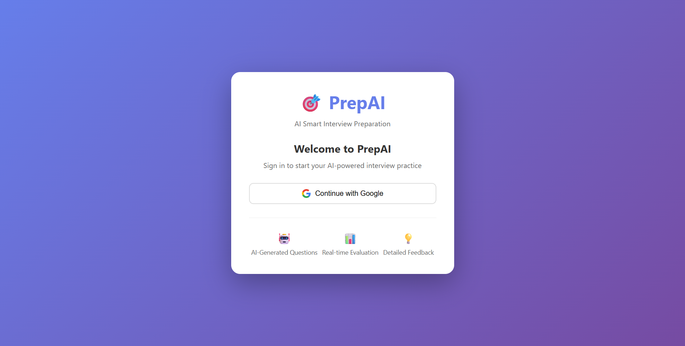
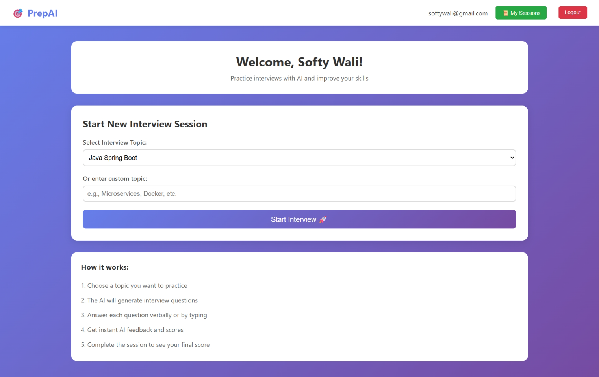
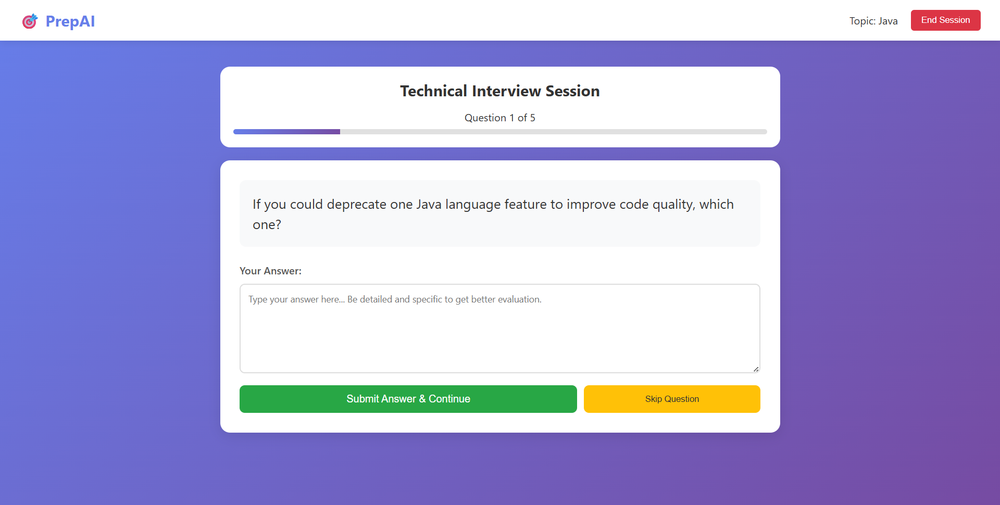
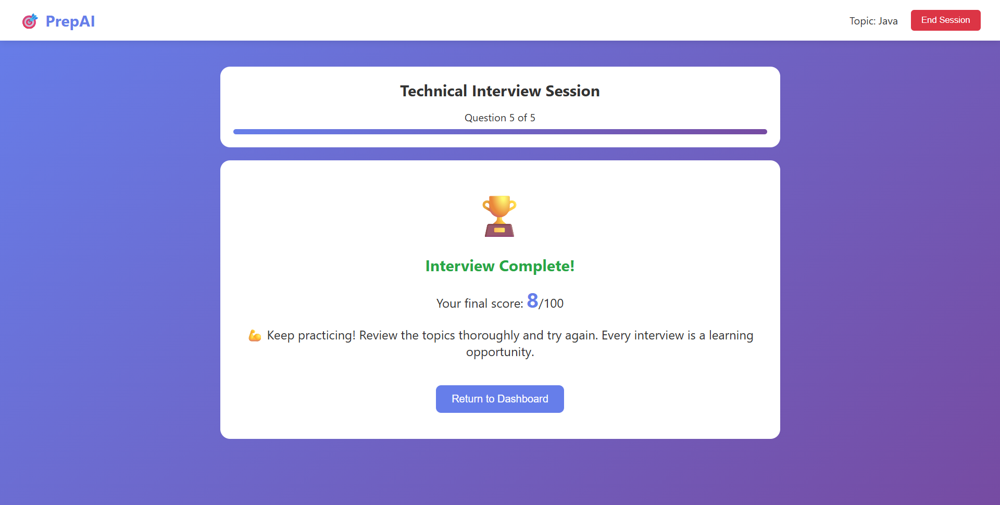
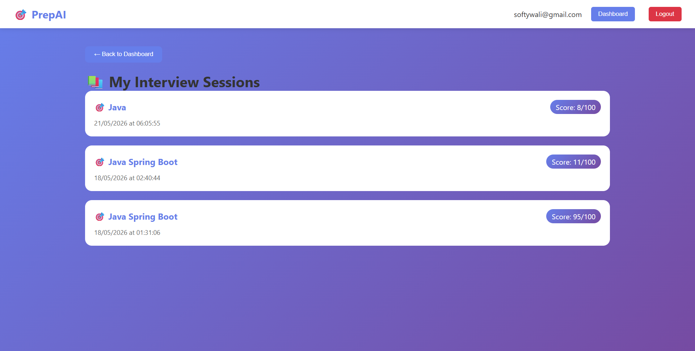

# PrepAI - Your Personal Interview Coach 🚀

Got an interview coming up? Let PrepAI help you practice and crush it. This is a full-stack app built with Spring Boot and modern web tech that uses AI to give you real-time feedback on your interview responses.

## What This Does

Think of it as having a 24/7 interviewer in your pocket. You answer interview questions, and the AI analyzes your responses and gives you actionable feedback to improve. Pretty cool, right?

## Getting Started

### Prerequisites
- Java 11+ 
- MySQL 
- Node.js (if running frontend separately)

### Backend Setup (Spring Boot)

1. **Set up the database**
   ```bash
   CREATE DATABASE prep_ai_db;
   ```

2. **Configure your DB credentials** in `application.properties`:
   ```properties
   spring.datasource.username=your_username
   spring.datasource.password=your_password
   ```

3. **Run it**
   - Open `spring-boot-backend/` in IntelliJ or Eclipse
   - Run `PrepAiApplication.java`
   - Server starts at `http://localhost:8080`

## Features in Action

### Login & Get Started


Start here. Simple, clean sign-in to access your practice sessions.

### Dashboard


Your hub. Track your progress, see completed interviews, and jump into new sessions.

### Interview Mode


Answer the AI-generated interview questions. The more you practice, the better you get.

### Instant Feedback


Get detailed feedback on your answer right after you submit. The AI breaks down what you did well and where to improve.

### Review Your History


Look back at all your past interviews. Track your improvement over time.

## How the Magic Works

**Frontend**: HTML/CSS/JavaScript for a smooth user experience

**Backend**: Spring Boot handles all the logic
- Controllers route your requests
- Services manage the interview flow and AI integration  
- JPA repositories talk to MySQL

**AI Integration**: Powered by Google's Gemini API
- Generates relevant interview questions
- Analyzes your answers in real-time
- Provides semantic feedback on how well you answered

## Project Structure

```
PrepAI/
├── prepai-frontend/          # Your UI (HTML/CSS/JS)
│   ├── index.html
│   ├── interview.html
│   ├── dashboard.html
│   ├── history.html
│   └── js/                   # Logic for frontend
├── spring-boot-backend/      # The engine
│   └── src/main/java/com/prepai/
│       ├── controller/       # Handles HTTP requests
│       ├── service/          # Business logic & AI calls
│       ├── model/            # Data structures
│       └── repository/       # Database access
└── images/                   # Screenshots (this readme's best friends)
```

## Key Tech Stack

| Part | Technology |
|------|------------|
| Backend | Spring Boot, Spring Data JPA |
| Frontend | HTML5, CSS3, Vanilla JavaScript |
| Database | MySQL |
| AI | Google Gemini API |
| Build | Maven |

## Interview Questions? 🎤

The app generates questions based on common interview patterns and your chosen topic. Each session is independent, so you can practice different areas.

## Feedback System

After you submit your answer:
1. Gemini analyzes your response
2. Checks for key points and clarity
3. Rates your answer quality
4. Gives you specific tips to do better next time

It's like having a mock interviewer who actually cares about your improvement.

## Building It Yourself

### Backend Build
```bash
cd spring-boot-backend
mvn clean install
mvn spring-boot:run
```

### Frontend
The frontend is already in `prepai-frontend/` - just open the HTML files in your browser or serve them with a local server.

## Database Schema Highlights

**Interview Sessions**: Stores your practice sessions with timestamps and results

**Questions**: Pre-populated with interview questions across different domains

**Responses**: Your answers get saved here so you can review them later

## Tips for Using This (From the Build Team)

1. **Practice regularly** - The more interviews you do, the better the AI can track your progress
2. **Read the feedback carefully** - It's not just a score, it's actual advice to get better
3. **Review your history** - You'll be surprised how much you improve over time
4. **Try different topics** - Don't just stick to one area

## Viva/Interview Prep Tips 💡

### For explaining this project:
- **"We integrated Gemini AI using REST APIs to analyze interview responses in real-time"**
- **"Spring Data JPA abstracts the database layer, letting us work with data as Java objects"**
- **"The MVC architecture keeps our concerns separated: Spring Boot handles logic, MySQL handles data"**

## Troubleshooting

**"I can't connect to the database"**
- Check MySQL is running
- Verify credentials in `application.properties`
- Make sure the `prep_ai_db` database exists

**"The AI isn't giving feedback"**
- Check your Gemini API key is configured
- Make sure you have internet connection
- Look at the backend logs for errors

## What's Next?

Ideas to make this even better:
- Add video recording for practice interviews
- Implement different difficulty levels
- Create industry-specific question banks
- Add collaborative practice with friends

## License

Built for learning. Feel free to use and modify.

---

Good luck with your interviews! 🎯
